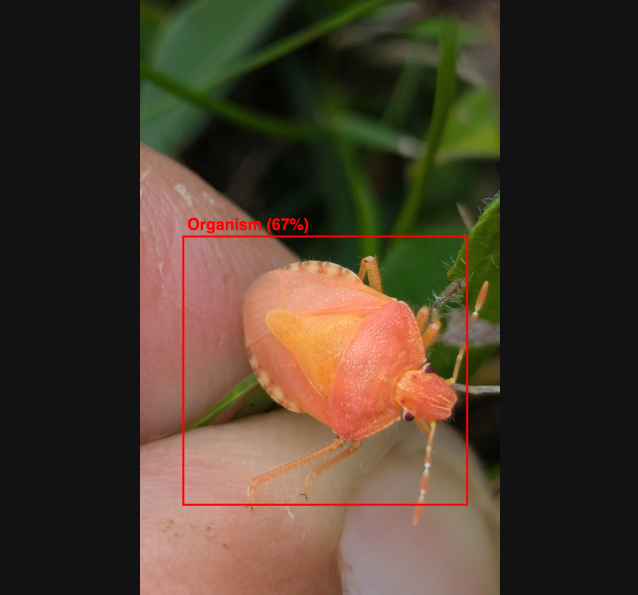
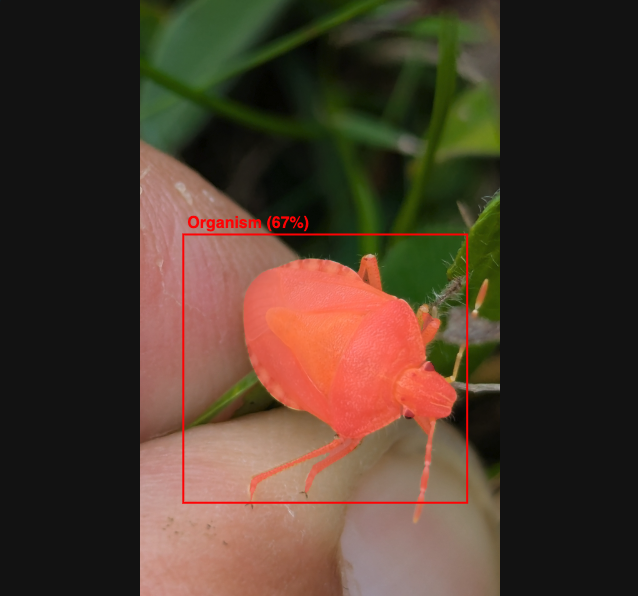

# 🐛 MoultGPT

**MoultGPT** is a modular text + vision system for extracting biologically meaningful moulting traits of arthropods from both **scientific articles** and **images**.

The project is split into two main components:

- **Vision pipeline (`vision/`)** – given an arthropod image, it:
  - detects organism and exuviae with a fine-tuned YOLO model,
  - builds a segmentation-like mask,
  - extracts geometric / colour features,
  - predicts the moulting stage and related attributes.

- **LLM pipeline (`llm/`)** – given a DOI, PDF, or plain text, it:
  - downloads the paper (via Unpaywall),
  - converts PDF → TEI XML → plain text (via GROBID),
  - selects sentences relevant to moulting using an ontology-driven summarizer,
  - checks that the paper + question are in scope (arthropod moulting only),
  - queries a **remote** LLM (no local GPU / no downloaded weights — see
    "Text / LLM module" below) and returns one `Field Name: value` line per supported trait with clear textual evidence (`full_traits` mode, the default; a narrower single-field YAML mode also exists).
  - the same request can be run against several different free-tier models
    for comparison (`llm/eval/compare_models.py`).


The long-term goal is a **specialised assistant** for arthropod moulting, combining text mining and computer vision under a single API and GUI — a first version of that unified GUI (`frontend/`) now exists as a demo layer in front of the two backends; see below.

---

## 🚀 Unified demo (recommended entry point)

`frontend/` is a single-page demo (`index.html`) plus a tiny reverse-proxy
gateway (`app.py`) that puts both pipelines behind one URL: scan a paper
(DOI / PDF / raw text) or scan an image from the same page, no separate
tabs or ports to juggle. It's the "everything at once" entry point; the
per-backend testers described further down still exist for focused
debugging of just the LLM or just the vision pipeline.

**Via Docker (simplest):**

```bash
cp llm/.env.example llm/.env   # fill in at least one provider key
docker compose up --build
```

Open **http://localhost:8080**. `docker compose` starts GROBID, the LLM
backend, the vision backend, and the gateway together; the gateway is the
only new image and is deliberately tiny (Flask + requests, no ML deps —
see `frontend/app.py`'s docstring for why it's a separate lightweight
process rather than importing both backends into one).

**Without Docker:** start `llm/backend/app.py` and `vision/backend/app.py`
as usual (see their sections below), then in a third terminal:

```bash
cd frontend
pip install -r requirements.txt
python app.py
```

Open **http://localhost:8080**. The gateway defaults to proxying
`localhost:5002` / `localhost:5001`; override with `LLM_BACKEND_URL` /
`VISION_BACKEND_URL` env vars if your backends run elsewhere.

**What the unified demo exposes, beyond a minimal wrapper:**
- Text scan: DOI / PDF / raw text, model selection, full-traits vs
  single-trait mode — same `/query` endpoint as the LLM tester.
- Image scan: clade selection (Crustacea / Hexapoda / Chelicerata /
  Myriapoda — the same taxon groups the XGBoost stage classifier was
  trained on) and an optional FastSAM segmentation toggle, with detection
  boxes *and* segmentation masks overlaid on the uploaded image.
- Inline feedback (👍/👎 + comment) on every text response, saved via
  `POST /feedback` — the same signal `llm/finetuning/` is meant to train on.

---

## 🔬 High-level Architecture

### 1. Vision / CNN–YOLO module (`vision/`)

> The vision pipeline is currently exposed as a separate demo (MoultVision), and is designed to be integrated with the LLM-based traits in a unified MoultGPT API.

1. **Object detection (YOLO)**
   - Fine-tuned YOLO model detects:
     - `organism` (living specimen),
     - `exuviae` (shed exoskeleton).
   - Produces bounding boxes with class labels and confidences.
   - Weights ship directly in the repo: `vision/models/yolo_detect.pt`
     (YOLO11n, fine-tuned; see the paper for the architecture comparison
     and hyperparameter search behind this choice).

2. **Segmentation-style masks**
   - From the bounding boxes, the pipeline generates a **mask channel** distinguishing:
     - organism region,
     - exuviae region,
     - background.
   - This mask can be concatenated with RGB as a 4th channel for CNN models, or used to derive geometric features.

3. **Feature extraction & classification (XGBoost)**
   - Geometric features:
     - box coordinates, IoU overlap, centroid distance, exuvia height, etc.
   - Intensity / colour statistics:
     - mean RGB / grayscale per region.
   - Taxonomic one-hot features (Chelicerata / Myriapoda / Crustacea / Hexapoda).
   - Stage assignment is **not** a single 4-way classifier call. A deterministic
     rule handles single-entity images; `XGBoost` is only invoked for the
     ambiguous both-detected case:
     - exuvia detected, no organism → `exuviae` (rule)
     - organism detected, no exuvia → `post-moult` (rule)
     - both detected → `XGBoost` predicts `moulting` vs. `post-moult`
   - `XGBoost` was selected over Logistic Regression, SVM (RBF), and Random
     Forest after a 4-model benchmark on held-out validation data (macro F1
     0.870 vs. 0.862 / 0.824 / 0.804 respectively); see
     `vision/scripts/results/classifier_benchmark_summary_OFFICIAL_SPLIT.csv`
     and the accompanying paper for the full comparison and methodology.
   - Weights ship in the repo directly (small enough for plain git, no LFS
     needed): `vision/models/xgboost_stage.pkl` + `vision/models/label_encoder.pkl`.

4. **Data generation**
   - The vision data used for YOLO and XGBoost is **self-generated** from iNaturalist images (only CC0, CC-BY, CC-BY-NC):
     - Raw images and metadata are processed by utility scripts (e.g. `vision/utility/build_dataset.py`).
     - The script constructs:
       - YOLO-style `images/` and `labels/` directories,
       - CSV feature tables for the XGBoost training pipeline.
   - Only **small subsets** and example files are kept in the public repo; large datasets are excluded.

5. **Rendering and frontend**
   - The MoultVision React frontend:
     - Lets the user upload an image,
     - Sends it to the Flask vision backend,
     - Displays:
       - 🟥 organism box,
       - 🟦 exuviae box,
       - 🟢 predicted stage + confidence,
       - optional FastSAM segmentation overlay (`FastSAM-x.pt`, downloaded
         separately — see the "Vision Backend" section below — not bundled
         in the repo due to its size).
   - Keypoint/pose annotation tooling exists
     (`vision/utility/annotation/annotate_keypoints_pose.py`) and was
     explored during dataset construction, but pose features are **not**
     part of the deployed stage-classification pipeline (see the paper's
     Annotation Protocol section).

---

### 2. Text / LLM module (`llm/`)

1. **Input**  
   - DOI (e.g. `10.1038/s41598-022-18146-3`)  
   - Local PDF  
   - Raw text (plain text or pre-extracted TEI)

2. **Acquisition & parsing**
   - `pipeline/downloader.py`  
     - Uses the **Unpaywall API** to resolve a DOI to an open-access PDF.  
   - `pipeline/parser.py`  
     - Calls **GROBID (CLI)** to convert PDF → TEI XML.  
     - Extracts textual content (title, abstract, body) as plain text.

3. **Taxonomy lookup & ontology gating**
   - `domain/optimized_taxonomy_lookup.py` (`TaxonomyLookup`)
     - Loads a CSV of arthropod taxa with canonical names and synonyms (GBIF, NCBI, iNaturalist).
     - Compiles regex patterns per taxon name and indexes taxonomic paths for fast lookup + ancestor propagation in free text.
   - `domain/moulting_ontology_gate.py` (`MoultingOntologyGate`)
     - Loads the MoultDB moulting OWL ontology (`llm/data/moultdb_moulting_ontology_v3_8.owl`) and indexes concept surface forms, semantic role, and gating weight.
     - Scores free text (sentences or queries) against those concepts.
   - `domain/domain_gate.py` (`analyze_paper_and_query_domain`)
     - **Paper taxonomy gate**: does the paper contain arthropod taxa?
     - **Paper summary gate**: is there enough moulting-related content (ontology-scored sentences)?
     - **Query gate**: does the question carry a moulting signal, and does it explicitly concern non-arthropods (birds, mammals, reptiles, fish, ...)?
     - Combines all three into a single `allow` / `final_label` / `message` decision.

   Together, these gates enforce the design choice:
   > **MoultGPT only answers questions about moulting in arthropods.**

4. **Sentence selection (moulting-related)**
   - `pipeline/summarization.py` (`extract_relevant_sentences`)
     - Splits the text into sentences.
     - Scores each sentence against the moulting ontology (not a hardcoded keyword list) via `MoultingOntologyGate`.
     - Uses **TF–IDF + K-Means** to select a diverse subset of the surviving sentences.
     - Output: a compact summary (typically ~20 sentences) focusing on moulting.
   - `pipeline/domain_pipeline.py` (`run_domain_pipeline`)
     - Ties summarization + the combined domain gate together into one function, shared by the live API (`llm/backend/app.py`) and the model-comparison script (`llm/eval/compare_models.py`), so both always see identical context for a given paper/query.

5. **LLM prompt construction and inference — remote, no GPU required**
   - `llm/backend/app.py`
     - Exposes a Flask API with `/query`, `/preprocess`, `/models` and `/feedback`.
     - Once the question and paper pass the gates:
       - Builds a system prompt specialised for arthropod moulting.
       - Sends it, together with the moulting-focused summary (context) and the user query, as chat messages.
     - Calls `llm/backend/providers.py`, a provider-agnostic layer that sends the request to whichever **remote** model was selected (`model` form field), instead of loading a model locally. No GPU, no multi-GB weights download.
     - Decoding uses temperature = 0 on every provider to reduce output
       variance (exact reproducibility isn't guaranteed for hosted
       "-latest" model aliases, which can change server-side — see the
       paper's Limitations).
     - Default mode (`full_traits`) returns one `Field Name: value` line
       per trait with clear textual support, skipping unsupported fields
       rather than guessing — no YAML, no bullet points, no prose:

     ```text
     Moulting stage: post-moult
     Taxa: Hurdiidae, Kerygmachela
     Evidence: The exuviae was found fully detached behind the specimen, with the new cuticle fully hardened.
     ```

     A narrower `single_trait` mode also exists (answers exactly one field
     as clean YAML) — see `llm/pipeline/prompting.py`.

6. **Model registry & multi-model comparison**
   - `llm/config/models.py`
     - Single source of truth listing every candidate model (id, provider, family, free-tier status). Used by `/models` (for a frontend dropdown), `/query` (to validate the requested model), and the comparison script below.
   - `llm/eval/compare_models.py`
     - Runs the exact same paper/query pairs through `run_domain_pipeline` once, then through **every** model in the registry, and writes one CSV row per (paper, query, model) — the basis for a model-comparison table in a publication.
   - `llm/backend/providers.py`
     - Adapters for OpenRouter, Mistral (La Plateforme) and Gemini. Adding a new provider means adding one adapter function here plus an entry in `models.py`.

7. **Feedback → preference data → DPO**
   - `/feedback` endpoint
     - Stores per-query feedback (model_id, 👍/👎 rating, optional comment) in `llm/backend/feedback/feedback.jsonl`. The unified demo's feedback buttons (`frontend/index.html`) are what actually populate this outside of manual testing.
   - `llm/finetuning/`
     - Local PEFT/LoRA (optionally QLoRA) fine-tuning track for an open-weight base model (originally Mistral-7B-Instruct), kept deliberately separate from the deployed remote-API path: `train_lora.py` (configurable hyperparameters, held-out eval split with loss/perplexity, optional W&B/MLflow tracking, per-run config dump for reproducibility), `serve_vllm.py` (vLLM-based local serving of the adapter, output-compatible with `eval/compare_models.py` so the local fine-tune can be benchmarked against the remote models on identical papers/queries), and `accelerate_config.yaml` for multi-GPU/FSDP training. Not the current production path — the live API intentionally calls remote providers for cost/latency reasons — but it is what you'd reach for if data sovereignty or full model control mattered more than they do for this particular demo (see the note on this trade-off further down).
     - `feedback_to_preferences.py` turns `feedback.jsonl` into DPO-style `{prompt, chosen, rejected}` pairs by grouping same-prompt entries with opposite ratings — the data-collection UI and the preference-optimization script are meant to be one loop, not two unrelated features.
     - `train_dpo.py` runs preference optimization (`trl.DPOTrainer` + a fresh LoRA adapter on top of the SFT one) on those pairs. Refuses to start below `--min_pairs` (default 8) rather than quietly overfitting to a handful of ratings.

8. **Retrieval-augmented context selection (RAG)** — `llm/retrieval/`
   - A query-*aware* alternative to the query-*agnostic* ontology summarizer above: embed a paper's sentences once, then re-rank them fresh for whatever's actually being asked, instead of always handing the model the same fixed summary regardless of the question.
   - Two embedding backends (`embedder.py`): `tfidf` (local, sparse, zero new dependencies) and `mistral-embed` (remote, dense, reuses the existing `MISTRAL_API_KEY` — no local GPU/weights, same design as `backend/providers.py`).
   - `evaluate_retrieval.py` actually runs all of this against this repo's own paper corpus (`llm/finetuning/papers/*.tei.xml`, extracted via `pipeline.parser.tei_to_text` — no GROBID service needed) and writes real, reproducible numbers to `eval_results.md`: on 5 hand-written queries with keyword-verified expected content, the production ontology method hit 4/5 and the new TF-IDF retriever hit 5/5 — with an honest discussion of why that specific comparison favors a query-aware method by construction, and what it doesn't prove. See `llm/retrieval/README.md`.
   - Not yet wired into `/query`'s live path — see that file's "Status" section for what's actually validated vs. implemented-but-unverified (`mistral-embed` needs a real API key to check).


---

## 📦 Repository Structure (simplified, public-ready)

Only lightweight, GitHub-safe files are included.  
Heavy models, large datasets, logs, and PDFs are excluded.

```text
.
├── llm/
│   ├── backend/
│   │   ├── app.py                # Flask API (LLM backend, routing, gating, remote LLM call)
│   │   ├── providers.py          # OpenRouter / Mistral / Gemini adapters (no local model)
│   │   └── feedback/             # JSONL feedback, tagged with model_id
│   ├── config/
│   │   └── models.py             # Registry of candidate remote models (id, provider, family)
│   ├── pipeline/
│   │   ├── downloader.py         # DOI → PDF via Unpaywall
│   │   ├── parser.py             # PDF → TEI (GROBID) → text
│   │   ├── summarization.py      # extract_relevant_sentences(...)
│   │   ├── processor.py          # input_to_text(...), orchestration
│   │   └── domain_pipeline.py    # run_domain_pipeline(...): summary + combined gate
│   ├── domain/
│   │   ├── optimized_taxonomy_lookup.py  # TaxonomyLookup: taxon name index + ancestor propagation
│   │   ├── moulting_ontology_gate.py     # MoultingOntologyGate: OWL-based concept scoring
│   │   └── domain_gate.py                # analyze_paper_and_query_domain(...)
│   ├── eval/
│   │   ├── compare_models.py     # run the same paper/query set across every registered model
│   │   └── dataset_example.json  # example input for compare_models.py
│   ├── frontend/
│   │   └── index.html            # web UI served at /ui (no build step)
│   ├── data/
│   │   ├── arthropod_taxonomy.csv           # compact taxonomic dictionary extracted from moultdb.org
│   │   ├── moultdb_moulting_ontology_v3_8.owl  # current moulting ontology (OWL)
│   │   └── summaries/                       # small text summaries (no full TEI/PDF)
│   ├── tests/
│   │   ├── test_domain_gate.py    # domain-gate decision table, all branches
│   │   ├── test_prompting.py      # prompt-construction contract (both modes)
│   │   ├── test_models_registry.py  # model-registry structural invariants
│   │   └── test_feedback_to_preferences.py  # feedback → DPO pair-building logic, 11 cases
│   ├── retrieval/                 # RAG: query-aware retrieval, alternative to the ontology summarizer
│   │   ├── embedder.py            # TfidfEmbedder (local) / MistralRemoteEmbedder (remote, reuses MISTRAL_API_KEY)
│   │   ├── index.py               # Chunk + VectorIndex (cosine similarity, no FAISS)
│   │   ├── build_index.py         # chunk a paper corpus and build/save a VectorIndex
│   │   ├── retrieve.py            # CLI: retrieve_top_k(query, index, embedder, k)
│   │   ├── evaluate_retrieval.py  # real comparison: ontology vs tfidf vs mistral-embed (see eval_results.md)
│   │   ├── eval_results.md        # actual executed results, 5 real queries against this repo's papers
│   │   └── README.md              # module rationale, quickstart, honest status
│   └── finetuning/
│       ├── train_lora.py          # PEFT/LoRA (QLoRA) fine-tuning, eval split, W&B/MLflow tracking
│       ├── serve_vllm.py          # local vLLM serving/benchmarking of the fine-tuned adapter
│       ├── feedback_to_preferences.py  # feedback.jsonl → {prompt, chosen, rejected} DPO pairs
│       ├── train_dpo.py           # trl.DPOTrainer + LoRA, optionally starting from an SFT adapter
│       ├── accelerate_config.yaml # example multi-GPU/FSDP launch config
│       ├── requirements-research.txt  # torch/transformers/peft/accelerate/vllm/wandb/mlflow/trl
│       └── modules/               # dataset-generation helpers (annotations → instruction/output pairs)
│
├── vision/
│   ├── backend/
│   │   └── app.py                # Flask API for YOLO + features + stage classification
│   ├── models/
│   │   ├── yolo_detect.pt        # fine-tuned YOLO11n detector (~5 MB)
│   │   ├── xgboost_stage.pkl     # stage classifier (moulting vs. post-moult)
│   │   └── label_encoder.pkl     # matching label encoder
│   │       # FastSAM-x.pt not included (~139 MB) -- download separately,
│   │       # see "Vision Backend -- How to Run" above
│   ├── data/
│   │   ├── yolo/                 # tiny YOLO sample dataset (images + labels)
│   │   └── inat_raw/             # small raw sample only (full dataset excluded)
│   ├── frontend/
│   │   └── src/                  # React interface (MoultVision)
│   ├── scripts/
│   │   ├── training/             # YOLO / XGBoost training utilities
│   │   └── yolo/                 # YOLO-specific helpers (e.g. split_dataset_yolo.py)
│   └── utility/
│       ├── annotation/           # bounding box / keypoint annotation tools
│       └── build_dataset.py      # generates features / splits from raw data
│
├── frontend/                  # unified demo: gateway + single-page UI for both pipelines
│   ├── app.py                 # tiny reverse-proxy (Flask + requests only, no ML deps)
│   ├── index.html             # single-page demo: text scan + image scan, one URL
│   ├── requirements.txt
│   └── Dockerfile
│
├── output/                    # example images used in the README
├── docker-compose.yml         # grobid + llm-backend + vision-backend + gateway
└── README.md
```


---

## 🧪 Vision Backend – How to Run

### 1. Requirements

- Python ≥ 3.10  
- `conda` or `venv` recommended  
- GPU optional (YOLO runs fine on CPU for demo purposes)

> **Model weights:** `vision/models/yolo_detect.pt`, `xgboost_stage.pkl`,
> and `label_encoder.pkl` ship directly in the repo (well under GitHub's
> size limits). `FastSAM-x.pt` (~139 MB, used only for the optional
> segmentation overlay) is **not** included — download it from the
> [FastSAM releases](https://github.com/CASIA-IVA-Lab/FastSAM) and place
> it at `vision/models/FastSAM-x.pt` if you want the segmentation toggle;
> detection and stage classification work fine without it.

### 2. Create and activate environment

```bash
conda create -n moultgpt_vision python=3.10
conda activate moultgpt_vision
pip install -r vision/requirements.txt
```

### 3. Start the vision backend

```bash
cd vision/backend
python app.py
```

### 4. Start the vision frontend

```bash
cd vision/frontend
npm install
npm start
```

A React interface opens at http://localhost:3000, where you can upload an image and visualize:
- 🟥 organism box
- 🟦 exuviae box
- 🟢 predicted stage + confidence

---


## 🖼️ Vision Module – Examples

### YOLO + stage classifier (3 examples)

|  |  |  |
|:----------------------------------:|:----------------------------------:|:----------------------------------:|
| post-moult (0.82)                  | exuviae (0.75)                     | organism (0.67)                    |

---

### Segmentation-style overlays (3 examples)

|  |  |  |
|:------------------------------------------------------:|:-------------------------------------------------------:|:------------------------------------------------------:|
| organism + exuviae mask                                | exuviae-only mask                                       | organism-only mask                                     |

---

## 🧪 LLM Backend – How to Run

**No GPU and no local model download required.** The LLM call goes to a
remote provider (OpenRouter / Mistral / Gemini — see `llm/config/models.py`),
so this backend runs comfortably on a laptop.

### 1. Requirements

- Python ≥ 3.10
- `conda` or `venv` recommended
- Access to a local **GROBID** service (CLI or HTTP, typically `http://localhost:8070`) — only needed for DOI/PDF input, not for the LLM call itself.
- At least one API key for a provider in `llm/config/models.py` (all have a free tier; see that file for links).

### 2. Create and activate environment

```bash
conda create -n moultgpt_llm python=3.10
conda activate moultgpt_llm

cd llm
pip install -r requirements.txt
```

### 3. Environment variables

Copy `llm/.env.example` to `llm/.env` and fill in the key(s) for the
provider(s) you want to use:

```bash
cp llm/.env.example llm/.env
# then edit llm/.env:
#   OPENROUTER_API_KEY=...
#   MISTRAL_API_KEY=...
#   GEMINI_API_KEY=...
#   UNPAYWALL_EMAIL=your@email.com
```

GROBID configuration (URL) can be overridden via `GROBID_URL`, defaults to
`http://localhost:8070/api/processFulltextDocument`.

### 4. Start the LLM backend

From `llm/backend/`:

```bash
python app.py
```

The service exposes:

- `GET /` – health check (also reports whether the taxonomy/ontology resources loaded correctly)
- `GET /models` – list of candidate remote models (for a frontend dropdown)
- `POST /preprocess` – runs the pipeline up to summary + gating (no LLM call)
- `POST /query` – full pipeline including the remote LLM call (`model` field selects which one)
- `POST /feedback` – records feedback in JSONL, tagged with `model_id`

### 5. Web UI

With the backend running, open **http://localhost:5002/ui**: pick a DOI,
PDF, or raw text, write a query, select one or several models, and see the
responses side by side (with latency and gate-rejection reasons). Served
directly by Flask (`llm/frontend/index.html`), no separate npm/React setup.

### 6. Compare models on the same paper/query set

```bash
cd llm
python eval/compare_models.py --dataset eval/dataset_example.json --out eval/results.csv
```

Produces one CSV row per (paper, query, model), so every model can be
compared on identical context — see `llm/eval/compare_models.py` for the
dataset format and `--models` to restrict which models run.

### 7. Run the test suite

```bash
cd llm
pip install pytest   # not in requirements.txt on purpose — dev-only
python -m pytest tests -q
```

Covers the domain-gate decision table, prompt construction, and the model
registry's structural invariants — pure Python, no GPU/network/data files
required, so it's what runs in CI (`.github/workflows/ci.yml`) on every push.

### 8. Local fine-tuning / PEFT research track (optional, GPU required)

```bash
cd llm/finetuning
pip install -r requirements-research.txt
python train_lora.py --dataset output/finetune_full.jsonl --output_dir ../output/lora_mistral \
    --tracking wandb --run_name my-first-sweep
python serve_vllm.py --base_model mistralai/Mistral-7B-Instruct-v0.3 \
    --lora_path ../output/lora_mistral --dataset ../eval/dataset_example.json \
    --out ../eval/results_local_lora.csv
```

Separate from the deployed remote-API backend above — see the finetuning
entry in the Architecture and Repository Structure sections for what each
script does, and the "Relevance to AI research roles" section below for
why this track exists alongside the remote-API one.

---

## 📡 API Usage

### `POST /preprocess`

Debug endpoint, useful to inspect what the system sees before calling the LLM.

**Form fields (multipart/form-data):**

- `doi` (optional) – article DOI  
- `file` (optional) – uploaded PDF  
- `text` (optional) – plain text  

Priority: `doi` > `file` > `text`.

**Response example (JSON):**

```json
{
  "source": "doi",
  "full_text_chars": 36163,
  "full_text_preview": "Background: Extended parental care is a...",
  "summary": "Results: Here, we describe the post-embryonic growth of Fuxianhuia protensa...",
  "paper_taxonomy_gate": {
    "allow": true,
    "label": "arthropod_detected",
    "n_direct_matches": 3,
    "direct_matches": [
      {"canonical_name": "fuxianhuia protensa", "taxon_id": 123, "path": "1.72.5.3", "depth": 4}
    ]
  },
  "paper_summary_gate": {
    "allow": true,
    "label": "moulting_content_detected",
    "n_summary_sentences": 20,
    "min_summary_sentences": 5
  },
  "paper_is_relevant": true
}
```

---

### `POST /query`

Main endpoint: returns YAML extracted by the LLM.

**Form fields (multipart/form-data):**

- `prompt` (**required**) – user question (e.g. *"What moulting traits are reported for Hurdiidae and Kerygmachela in this paper?"*)
- `model` (optional) – one of the ids from `GET /models` (defaults to `config.models.DEFAULT_MODEL_ID`)
- `doi` (optional)
- `file` (optional)
- `text` (optional)

Same priority: `doi` > `file` > `text`.

Out-of-scope example:

```json
{
  "error": "out_of_scope",
  "message": "The query appears to concern moulting in non-arthropods (bird, feather).",
  "reason": "query_out_of_scope",
  "paper_taxonomy_gate": {"...": "..."},
  "paper_summary_gate": {"...": "..."},
  "query_gate": {"...": "..."}
}
```

Successful example (`full_traits` mode, the default):

```json
{
  "response": "Moulting stage: post-moult\nTaxa: Hurdiidae, Kerygmachela\nEvidence: The exuviae was found fully detached behind the specimen, with the new cuticle fully hardened.\n",
  "provider": "mistral",
  "model_id": "mistral-small-latest",
  "model_label": "Mistral Small",
  "model_latency_sec": 2.1,
  "total_latency_sec": 5.42,
  "routing_label": "in_scope",
  "n_relevant_sentences": 20
}
```

`response` is a flat list of `Field Name: value` lines (one per supported
trait), deliberately not YAML — trivial to parse deterministically without
requiring valid YAML syntax from the model. Pass `mode=single_trait` for
the older, narrower clean-YAML behaviour. Run the same request with a
different `model` field (or via `llm/eval/compare_models.py` for many at
once) to compare outputs across providers.

---

## 🎯 Example gating behaviour

Given a paper clearly about arthropods (e.g. Cambrian euarthropods):

- ✅ “What moulting traits are reported for Hurdiidae and Kerygmachela in this paper?”  
- ✅ “Extract all information related to moulting of the species in this paper.”  
- ✅ “Summarise all moulting traits of the spider described in this paper.”  
- ❌ “How often do birds moult their feathers?” → rejected (vertebrates).  
- ❌ “Which species is described in this paper?” → rejected (not moulting-focused).  
- ❌ “What is the GDP of France?” → rejected (off-topic).

Given an economics paper with no arthropods and no moulting sentences:

- All moulting-related questions are rejected at the **paper gate** with:  
  *“The provided article does not seem to contain enough moulting-related content to answer questions reliably.”*

---

## 🔭 Roadmap

Planned work includes:

- **Model comparison for publication**: run `llm/eval/compare_models.py` over a curated set of annotated papers, with a small gold-standard set of expected YAML answers, to report accuracy/agreement per model.
- **Version pinning**: replace "latest"-style model aliases in `llm/config/models.py` with exact dated ids before any comparison run used in a paper.
- ~~**Full integration** of text traits (LLM) and image traits (YOLO + XGBoost / CNN) into a single GUI~~ — done as a demo layer: `frontend/` (see "Unified demo" above). Still separate APIs behind one gateway rather than one merged API — that's next if the two pipelines' outputs need to be combined into one response, not just one page.
- ~~**Containerisation / deployment**: Docker image for the LLM backend and the vision backend~~ — done, plus a third (`frontend/`) for the gateway; all three build in CI.
- **Frontend model selector in the React vision UI**: `vision/frontend/` doesn't yet share the unified demo's clade/segmentation controls — worth porting back if the React app stays in active use rather than being superseded by `frontend/`.
- **Multi-model comparison in the unified demo**: `frontend/index.html` currently queries one model at a time; the original LLM tester's side-by-side multi-model view (checkbox selection, one result card per model) isn't ported over yet.
- Local fine-tuning track (`llm/finetuning/`): run a small sweep over LoRA rank/target modules with tracking on, then benchmark the served adapter (`serve_vllm.py`) against the remote registry on the same dataset used by `eval/compare_models.py`, as a controlled open-weight-vs-remote comparison point.
- Extend `llm/tests/` beyond the current domain-gate / prompting / registry / feedback-to-preferences coverage to the taxonomy lookup and ontology-scoring modules (these need the OWL/CSV data files, so they're not yet part of the dependency-free CI test job).
- ~~**Retrieval-augmented generation**: query-aware retrieval as an alternative/complement to the fixed ontology-gate summary~~ — done as `llm/retrieval/` (TF-IDF working end-to-end with real evaluation numbers; `mistral-embed` implemented but unverified without a live API key). Next: wire a retrieval mode into `/query` itself rather than leaving it a standalone comparison script, and evaluate on a larger, less hand-picked query set than the current 5.
- ~~**Preference optimization from real feedback**: close the loop from the demo's 👍/👎 buttons to an actual training run~~ — done as `feedback_to_preferences.py` + `train_dpo.py` (pair-building logic unit-tested; the DPO training run itself hasn't been executed yet — it needs a real feedback corpus larger than what a demo generates in its first days, which `--min_pairs` deliberately enforces rather than papering over).

---

## 🎯 Relevance to AI research / LLM engineering roles

MoultGPT is a domain-specific research project (arthropod moulting), but
the components below map fairly directly onto the day-to-day work of an
applied AI research role — designing experiments, fine-tuning and
evaluating LLMs, and keeping the whole thing reproducible:

- **LLM fine-tuning, PEFT/LoRA, evaluation** — `llm/finetuning/train_lora.py`
  fine-tunes an open-weight base model (originally Mistral-7B-Instruct) with
  LoRA/QLoRA via the Hugging Face `transformers` + `peft` stack: configurable
  hyperparameters, a held-out eval split with loss/perplexity rather than
  training loss alone, a fixed seed plus a per-run `run_config.json` dump for
  reproducibility, and optional Weights & Biases / MLflow tracking.
- **Multi-model, evaluation-driven comparison** — `llm/eval/compare_models.py`
  runs identical (paper, query) pairs through every model in the registry
  (`llm/config/models.py`) and records not just the response but the routing
  decision and latency per row — the point being that a comparison table is
  only meaningful if every model saw exactly the same context, and failures
  (gated-out, provider error) are as informative as successes.
- **Local inference / serving** — `llm/finetuning/serve_vllm.py` serves the
  LoRA adapter with vLLM (paged attention, dynamic adapter loading) and
  writes output in the same schema as `compare_models.py`, so the local
  fine-tune drops into the same benchmark as the remote models.
- **Distributed training** — `accelerate_config.yaml` (FSDP, multi-GPU) for
  scaling `train_lora.py` beyond a single GPU via `accelerate launch`.
- **Retrieval-augmented generation, evaluated not just implemented** —
  `llm/retrieval/` adds a query-aware alternative to the ontology-gate
  summarizer (TF-IDF locally, `mistral-embed` remotely, no FAISS/torch
  dependency added), and `evaluate_retrieval.py` actually runs both methods
  against this repo's own paper corpus and reports real numbers
  (`eval_results.md`) rather than describing the module and stopping there —
  including which comparison (mistral-embed) still needs a live API key to
  verify.
- **Closing the human-feedback loop with DPO** — the unified demo's 👍/👎
  buttons aren't decorative: `feedback_to_preferences.py` turns same-prompt,
  opposite-rated feedback into `{prompt, chosen, rejected}` pairs (11 unit
  tests on the grouping/pairing logic, since that part is fast and
  deterministic enough to test without a GPU), and `train_dpo.py` runs
  `trl.DPOTrainer` on them, optionally starting from an existing SFT LoRA
  adapter. It refuses to start below a minimum pair count rather than
  quietly overfitting a few ratings — the same "don't fake it" instinct as
  the RAG evaluation above.
- **Reliability / guardrails as an evaluation problem** —
  `domain/domain_gate.py` combines a taxonomy lookup and an OWL-ontology
  concept scorer into a single in-scope/out-of-scope decision with a
  labelled reason, gating every LLM call. It's a rule-based (not learned)
  gate, but the underlying question — how do you keep a model from
  confidently answering questions it has no business answering — is the
  same one behind guardrails and refusal-calibration work on larger systems.
- **Research code quality** — `llm/tests/` (pytest, dependency-free,
  covers the domain gate's full decision table, prompt construction, and
  the model registry's invariants) runs on every push via
  `.github/workflows/ci.yml`, alongside a Docker build check for both
  services.
- **Reproducible ML pipelines on real (messy) data** — the GROBID +
  Unpaywall pipeline (`llm/pipeline/`) turns a DOI/PDF into clean text,
  and `llm/finetuning/main_generate_dataset.py` turns expert-annotated
  spreadsheets into instruction-tuning examples — the "turn ambiguous
  research questions and messy source data into a working pipeline" loop
  in miniature.
- **Containerised, CI-checked services** — a `Dockerfile` per service
  (LLM backend, vision backend, and the `frontend/` gateway) plus
  `docker-compose.yml` for local orchestration (GROBID + LLM backend +
  vision backend + gateway), all three application images built on every
  push in CI.
- **Multimodal, unified behind one entry point** — text (LLM trait
  extraction) and vision (YOLO detection + XGBoost/CNN stage
  classification) as two independent pipelines sharing one target domain,
  now reachable from a single page/URL via `frontend/` — a thin gateway on
  purpose, so the two pipelines' own dependency footprints and deploy
  cadence stay decoupled rather than merging into one monolith.

One intentional design tension worth naming rather than glossing over: the
**deployed** LLM backend calls remote provider APIs (OpenRouter / Mistral /
Gemini) rather than a locally-controlled model — the right trade-off for a
research demo with no dedicated GPU budget, but the opposite of the
data-sovereignty and full-model-control priorities behind a project like
Giotto.ai. The `llm/finetuning/` track exists precisely as the other half
of that trade-off: an open-weight, locally fine-tuned and locally served
alternative, kept in the repo and CI-adjacent (tests, reproducible configs)
rather than left as a one-off script, for when control over the model
matters more than the convenience of a hosted API.

---

## 📚 References and Tools

- [Mistral AI — La Plateforme](https://docs.mistral.ai/)
- [OpenRouter](https://openrouter.ai/docs)
- [Google Gemini API](https://ai.google.dev/)
- [GROBID](https://github.com/kermitt2/grobid)
- [Unpaywall API](https://unpaywall.org/products/api)
- [rdflib](https://rdflib.readthedocs.io/)
- [Ultralytics YOLO](https://github.com/ultralytics/ultralytics)
- [XGBoost](https://xgboost.readthedocs.io/)
- [scikit-learn](https://scikit-learn.org/)
- [Hugging Face Transformers](https://huggingface.co/docs/transformers/) / [Datasets](https://huggingface.co/docs/datasets/) / [PEFT](https://huggingface.co/docs/peft/)
- [Accelerate](https://huggingface.co/docs/accelerate/) (multi-GPU / FSDP launch)
- [vLLM](https://docs.vllm.ai/) (local LoRA-adapter serving)
- [Weights & Biases](https://docs.wandb.ai/) / [MLflow](https://mlflow.org/docs/latest/index.html) (experiment tracking)
- [pytest](https://docs.pytest.org/)

---

## 📬 Contact

Project lead: **Michele Leone**  
Website: https://www.moulting.org
