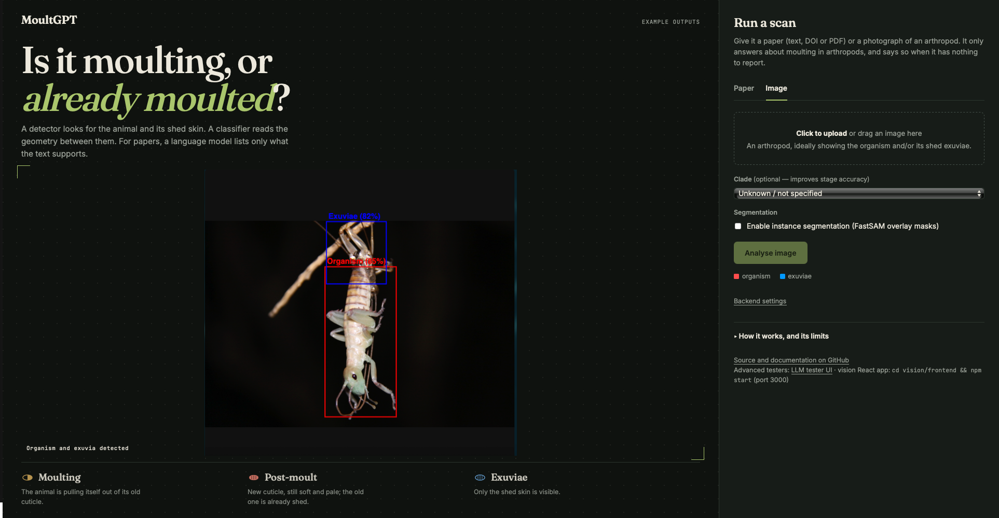
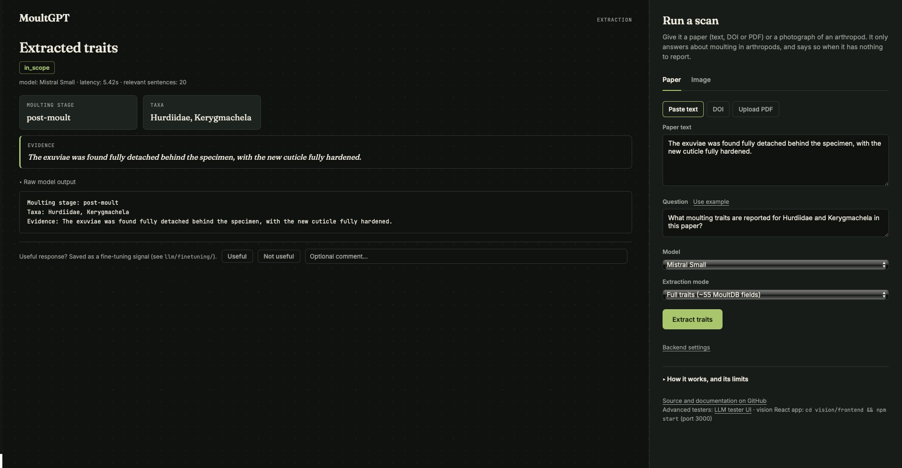

# 🐛 MoultGPT

[](https://github.com/MicheleRoar/MoultGPT/actions/workflows/ci.yml)

Extract moulting information about arthropods from **scientific papers** and from **photographs**, in one demo.





## What it does

| | Papers (`llm/`) | Photographs (`vision/`) |
|---|---|---|
| **Input** | DOI, PDF or text, plus a question | An arthropod photo |
| **How** | Taxonomy and moulting-ontology gates reject out-of-scope papers and questions; the most relevant sentences go to a remote LLM | YOLO11n finds the organism and the shed skin (exuvia); XGBoost estimates the stage from their geometry |
| **Output** | `Field: value` traits with the evidence sentence | Boxes and the moulting stage with a confidence |

It only answers about moulting in arthropods, and prefers saying nothing to guessing.

## Quick start

Needs Docker and one LLM provider key (free tiers work).

```bash
git clone https://github.com/MicheleRoar/MoultGPT.git && cd MoultGPT
cp llm/.env.example llm/.env      # add e.g. MISTRAL_API_KEY=...
docker compose up --build         # then open http://localhost:8080
```

To run on a server (HTTPS, rate limits, upload cap) see [DEPLOY.md](DEPLOY.md).

## Status

Research code with a manuscript in preparation.

- The served vision backend uses an older three-class model (`post-moult`, `moulting`, `exuviae`). The unified binary classifier is evaluated in `vision/scripts/pipeline/unified_classifier_eval.py` but not yet served.
- Vision accuracy is not quoted: the train/evaluation split is being re-audited for overlap.
- Text results come from a small gold set (21 papers) and an LLM judge from the same model family.

## Text results

Trait extraction against expert annotations (`llm/eval/trait_extraction/results/report.md`). *Correct* is out of 261 questions; *hallucinated* is out of 152 questions whose true answer is "nothing recorded".

| Model | Correct | Abstained | Hallucinated |
|---|---:|---:|---:|
| mistral-small | 3 | 246 | 1 (0.7%) |
| mistral-medium | 10 | 214 | 2 (1.3%) |
| mistral-large | 30 | 178 | 14 (9.2%) |
| keyword baseline | 29 | 178 | 21 |

The larger model answers more and also invents more when evidence is missing, which is why the pipeline gates its input and favours abstaining.

## Repository

```text
llm/        text pipeline, gates, evaluation, fine-tuning track
vision/     detector, stage classifier, training and evaluation scripts
frontend/   demo page and gateway
docs/       full technical reference
```

More: [technical reference](docs/DETAILS.md) · [LLM backend](llm/README_LLM.md) · [deployment](DEPLOY.md)

## Contact

Michele Leone · https://www.moulting.org
